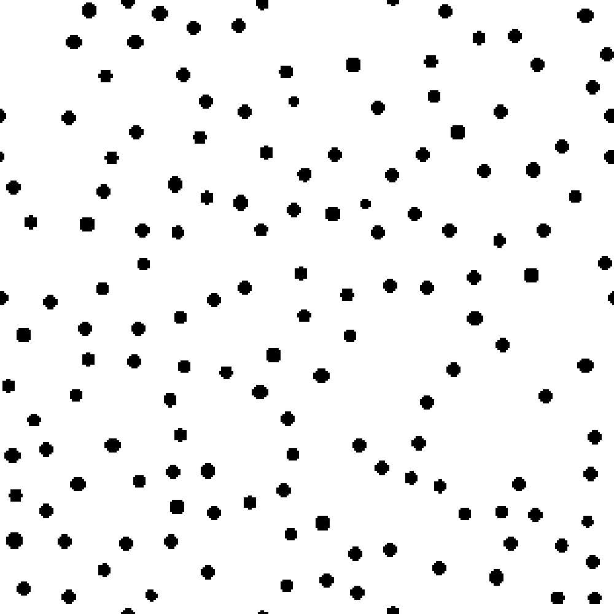
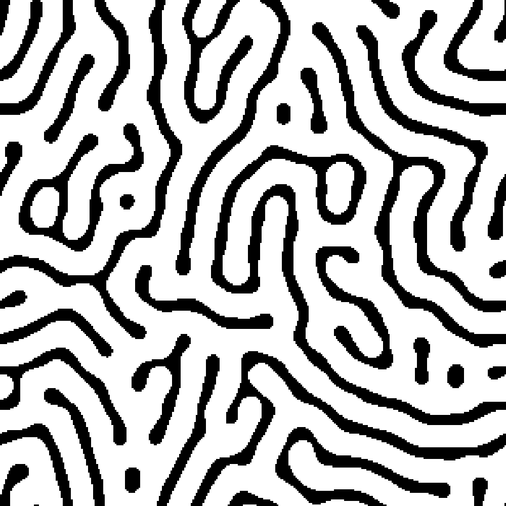
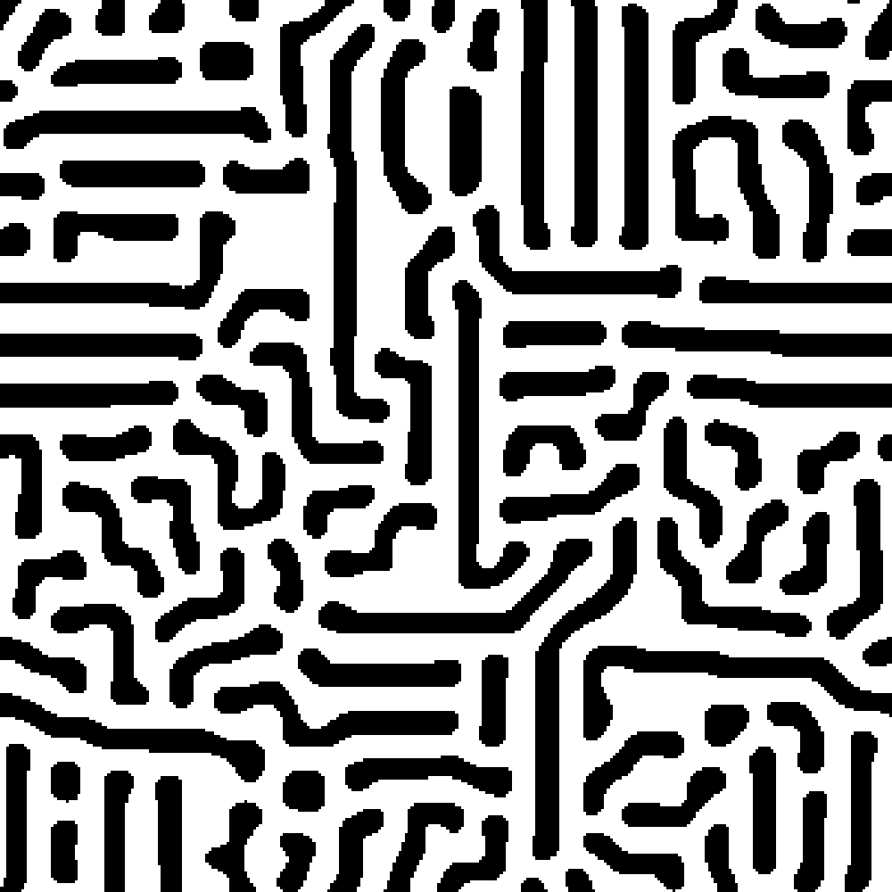
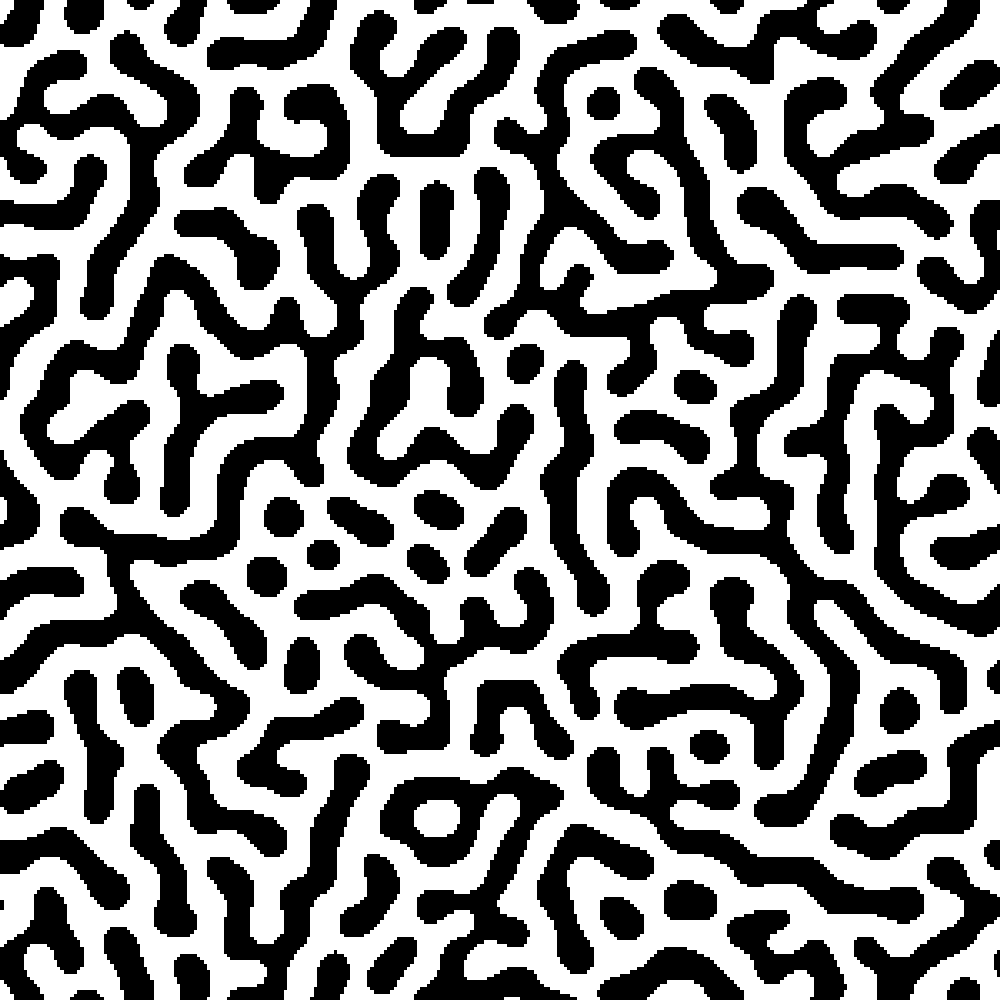
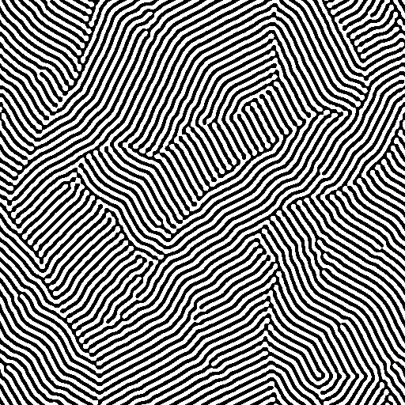
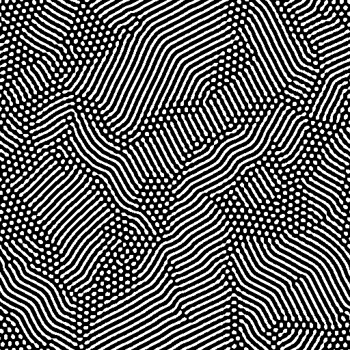
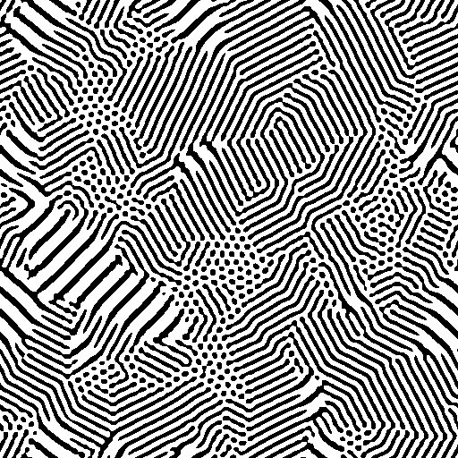

# Project Title

## Overview

This project explores Cellular Automata (CA) approaches to biological modeling, focusing on pattern adaptation. The work
is inspired by the paper titled "Cellular Automata Approaches to Biological Modeling" by G. Bard Ermentrout and Leah
Edelstein-Keshet. The project includes Python scripts implementing various CA models, each offering insights into
different aspects of biological phenomena.

## Table of Contents

- [Introduction](#introduction)
- [Deterministic Automata](#deterministic-automata)
    - [General Model](#general-model)
    - [Host-Parasite Model](#host-parasite-model)
    - [Predator-Prey Model](#predator-prey-model)
    - [Cellular Automata From More Complex Models](#cellular-automata-from-more-complex-models)
- [Developmental Biology](#developmental-biology)
    - [Pattern Adaption for Developmental Biology](#pattern-adaption-for-developmental-biology)
- [Discussion](#discussion)
- [Future Directions](#future-directions)
- [Usage](#usage)
    - [Prerequisites](#prerequisites)
    - [Running the Scripts](#running-the-scripts)
    - [Examples](#examples)
- [Contributing](#contributing)
- [License](#license)
- [Acknowledgements](#acknowledgements)

## Introduction

The paper chosen for study, "Cellular Automat Approaches to Biological Modeling" by G. Bard Ermentrout and Leah
Edelstein-Keshet, serves as the foundation for this project. The goal is to extend the authors' work by incorporating
pattern identification using convolution in image processing to understand the mechanism of pattern adaptation.

## Deterministic Automata

### General Model

Active media, mimicking biological behaviors, are explored through a simple excitable rule. The model includes
simulations of square-rotating spiral waves and modifications based on inhibitors or activators, creating diverse
spatial patterns.

<p align="center">
  
  
</p>

### Host-Parasite Model

A host-parasitoid model is discretized and placed on a grid, resembling an active CA. The system exhibits dynamic
interactions between host and parasite populations, leading to complex spatial patterns.

<p align="center">
  
  
</p>

### Predator-Prey Model

A fish-shark predator-prey model is considered, resulting in complex oscillations and spatial patterns. The simulation
captures the temporal evolution and interactions within the predator-prey system.


### Cellular Automata From More Complex Models

Translation from continuous to discrete domains is explored, including a reaction-diffusion system and an immunology
model. These models showcase the versatility of CA in representing complex biological phenomena.

### Developmental Biology

A simple model in developmental biology, incorporating lateral inhibition and thresholds, is presented. The model can
create spatial two-dimensional patterns mimicking animal coat patterns.

<p align="center">
  
  
  
  
</p>

## Pattern Adaption for Developmental Biology

The weight tensor used in the developmental biology model is analyzed to explore its potential as a convolution kernel.
The convolution method is applied to identify rules governing specific pattern formations, providing insights into the
adaptability of biological patterns.


<p align="center">
  
  
  
</p>

## Discussion

The use of Cellular Automata (CA) models offers a balance between simplicity, interpretability, and computational
efficiency. While CA models should not replace rigorous mathematical models, they provide a valuable initial step in
understanding complex biological phenomena.

## Future Directions

### Explaining Coat Patterns in an Evolutionary Perspective

Investigating the evolutionary origins of coat patterns by integrating genetic and environmental factors into the
modeling process.

### Exploring Dynamic Pattern Adaptation

Incorporating temporal dynamics into the convolution process to model how environmental changes and selective pressures
influence adaptive responses.

### Compressing Large Datasets of Biological Systems

Utilizing the weight tensor as a convolution kernel to efficiently compress large datasets while preserving salient
features.

## Usage

### Prerequisites

Make sure you have the following prerequisites installed on your machine:

- Python 3
- Numpy
- OpenCV (opencv-python)
- Numba

You can install the required packages using the following command:

```bash
pip install numpy opencv-python numba
```

### Running the Scripts

Each script in the project works independently. To run an example script, use the following command:

```bash
python3 scriptname.py
```

Replace `scriptname.py` with the actual name of the script you want to run.
Feel free to explore different scripts and experiment with the provided examples.

## Contributing

Contributions to the project are welcome. If you'd like to contribute, follow these steps:

1. Fork the project
2. Create a new branch
3. Make your changes
4. Submit a pull request

## License

This project is licensed under the MIT License - see the [LICENSE](LICENSE) file for details.

## Acknowledgements

- G. Bard Ermentrout and Leah Edelstein-Keshet for their foundational work on Cellular Automata in biological modeling.
- Other authors and researchers whose work has contributed to the project.
